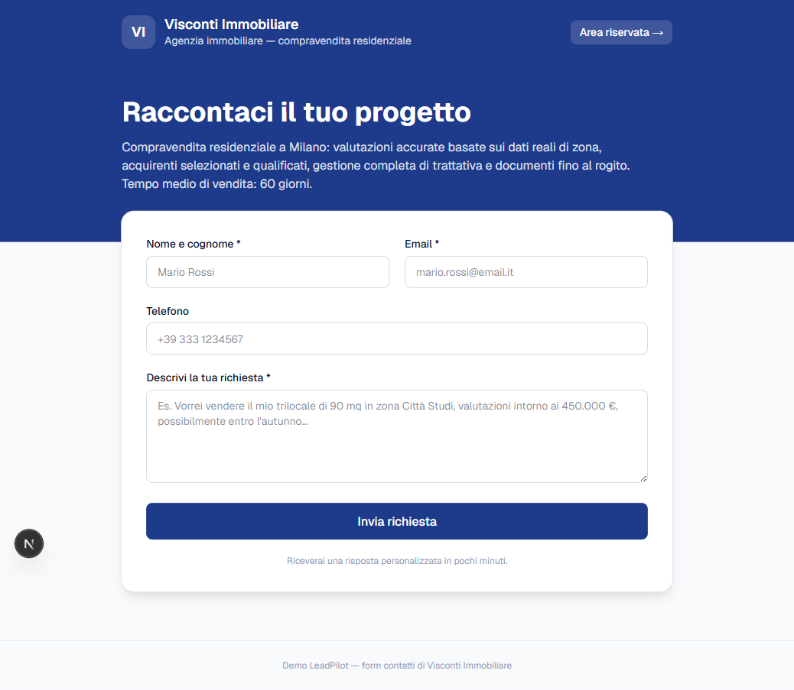
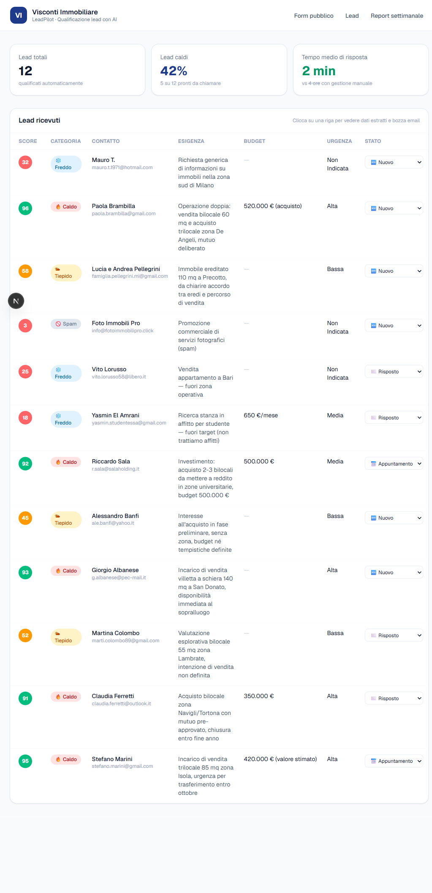
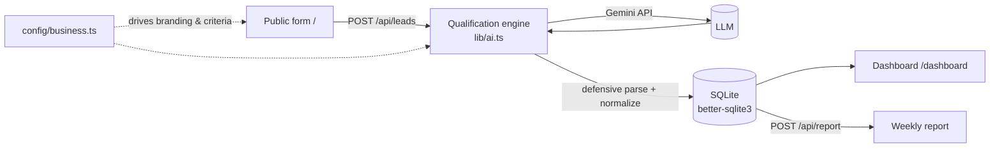

# LeadPilot 🎯

**AI-powered lead qualification for small businesses.** Every contact-form
submission is scored, categorized, enriched, and answered with a ready-to-send
draft email — in seconds instead of hours.

*Qualificazione lead con AI per le PMI: ogni richiesta dal form viene
valutata, categorizzata e gestita con una bozza di risposta pronta, in
pochi secondi. (L'interfaccia dell'app è in italiano.)*

> Built as a configurable demo: the entire app — branding, services,
> qualification criteria, tone — is driven by a **single config file**, so it
> can be re-skinned for any business in minutes.

---




## What it does

For each incoming lead, an LLM:

- assigns a **score 0–100** and a category (🔥 hot / 🌤 warm / ❄️ cold / 🚫 spam)
- extracts **structured data**: need, budget, urgency
- writes a **personalized reply draft** in the configured tone and language
- proposes **3 appointment slots** (next working days)
- and a separate endpoint generates a **weekly report** (trends, recurring
  themes, operational suggestions)

A dashboard shows all leads with colored scores, extracted data, expandable
email drafts, and a status workflow (new / replied / appointment).

## Architecture



The qualification flow is deliberately defensive: the model is asked for JSON,
but the response is parsed and **normalized** with safe fallbacks (score
clamping, category validation, spam enforcement) so a malformed or surprising
LLM response can never crash the request or leak an unwanted reply.

## Tech stack

| Layer | Choice | Why |
|---|---|---|
| Framework | **Next.js 16** (App Router) | Server routes + React UI in one project |
| Styling | **Tailwind CSS v4** | Fast, consistent, themeable via CSS variables |
| Database | **SQLite** (`better-sqlite3`) | Zero-config, synchronous, perfect for a self-contained demo |
| LLM | **Google Gemini** (`@google/genai`, `gemini-2.5-flash`) | Generous free tier — anyone can run it at no cost |
| Tests | **Vitest** | Unit tests on the pure logic (parsing, normalization) |
| Language | **TypeScript** (strict) | Type safety across API, DB, and config |

## Key engineering decisions

- **Config-driven, not hardcoded.** Brand, colors, services, qualification
  criteria and tone all live in [`config/business.ts`](config/business.ts).
  Swapping the imported preset re-skins the whole app and the AI behavior.
- **Defensive LLM output handling.** [`parseJsonDifensivo`](lib/ai.ts) strips
  code fences and isolates the JSON object; [`normalizzaRisultato`](lib/ai.ts)
  clamps the score, validates the category, and **forces spam to produce no
  reply** — regardless of what the model returned. Both are unit-tested.
- **Cost & token tracking.** Every call logs input/output tokens and an
  estimated cost, so running cost is measurable, not guessed.
- **Sector presets.** `config/presets/` ships ready-made configurations
  (real-estate, construction), each with its own seed dataset, so the demo is
  full and on-topic from the first launch.
- **Thinking disabled** on the qualification call (`thinkingBudget: 0`) — it's
  a fast structured task, so we skip the model's reasoning tokens for speed and
  cost.

## Getting started

```bash
# 1. Install
npm install

# 2. Configure the API key
#    Get a FREE Gemini key: https://aistudio.google.com/apikey
cp .env.example .env          # then paste your GEMINI_API_KEY

# 3. Seed the DB with 12 pre-qualified demo leads
npm run seed

# 4. Run
npm run dev
```

| Page | URL |
|---|---|
| Public form | http://localhost:3000 |
| Dashboard | http://localhost:3000/dashboard |
| Weekly report | http://localhost:3000/dashboard/report |

> The seed works **without** an API key (demo leads are pre-qualified). The key
> is only needed to qualify new leads from the form and to generate the report.

## Scripts

| Command | Description |
|---|---|
| `npm run dev` | Start the dev server |
| `npm run build` | Production build |
| `npm test` | Run unit tests (Vitest) |
| `npm run lint` | Run ESLint |
| `npm run seed` / `npm run demo:reset` | (Re)populate the DB with demo leads |
| `npm run test:leads` | Live end-to-end check: qualifies 8 realistic messages and prints score, category, draft and cost (needs the API key) |

## Project structure

```
config/business.ts        Active prospect config (imports a preset)
config/presets/           Ready-made sector configs (real-estate, construction)
lib/ai.ts                 Qualification engine + weekly report (Gemini)
lib/ai.test.ts            Unit tests for parsing & normalization
lib/db.ts                 SQLite schema and queries
app/page.tsx              Branded public form
app/dashboard/            Dashboard + report pages
app/api/leads/            POST (qualify & store) · GET · PATCH status
app/api/report/           POST (generate report) · GET (latest)
scripts/seed.ts           Seeds 12 sector-aware demo leads
```

## Customization

Change the imported preset in [`config/business.ts`](config/business.ts) (one
line: `immobiliare` or `edilizia`, or your own preset) and run
`npm run demo:reset` — the seed adapts to the active sector automatically.

## License

[MIT](LICENSE) © 2026 Giovanni Perniola
